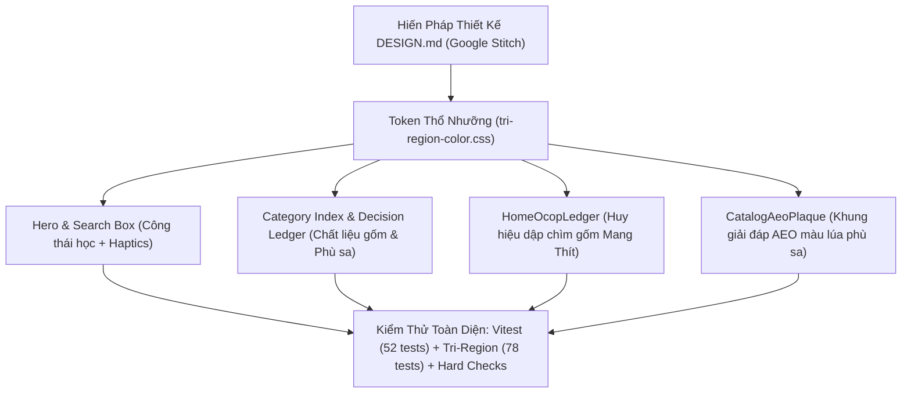

# Kế Hoạch Triển Khai: Tối Ưu Hóa Trang Chủ Sâu Sắc, Tinh Tế & Chống AI-Slop Toàn Diện (Kết Hợp Google Stitch)

> STATUS (2026-09-12): proposed — kế hoạch chi tiết chống AI-slop và đồng bộ Google Stitch.
> **Mục tiêu:** Nâng cấp và tối ưu hóa trang chủ Vĩnh Long 360 theo chuẩn thiết kế độc bản, loại bỏ triệt để mọi biểu hiện của "AI Slop" (giao diện rập khuôn, chữ nghĩa sáo rỗng, dữ liệu bịa đặt, gradient tím neon ngoại lai), đồng bộ hóa Hiến Pháp Thiết Kế (`DESIGN.md`) với Google Stitch MCP Project `14916181929760067680`.

---

## 1. Tóm Tắt Yêu Cầu & Bối Cảnh (User Request Summary)

Người dùng yêu cầu kết hợp kỹ năng `/writing-plans` với các năng lực thiết kế UI chuyên sâu (`frontend-design`, `taste-design`, `ui-ux-pro-max`, `impeccable`, `checklist-design`) cùng nền tảng **Stitch (stitch.withgoogle.com)** để:
1. **Nghiên cứu, phân tích, đánh giá và phản biện** sâu sắc về hiện trạng trang chủ, chỉ rõ và triệt tiêu các đặc tính "AI Slop".
2. **Nâng cấp trang chủ sâu hơn, tinh tế hơn, thông minh hơn** về mặt thị giác, xúc giác, công thái học và bản sắc thổ nhưỡng Vĩnh Long.
3. **Đặc tả Hiến Pháp Thiết Kế Chuẩn Stitch (`DESIGN.md`)** nhằm bảo vệ hệ thống thiết kế trường tồn, bất khả xâm phạm trước sự xói mòn của AI tạo sinh cẩu thả.

---

## 2. Phân Tích Hiện Trạng, Đánh Giá & Phản Biện Chống "AI Slop" (Critique & Counter-Argument)

### 2.1. "AI Slop" Trong Thiết Kế Giao Diện Du Lịch & Di Sản Là Gì?
Qua khảo sát và đối chiếu với các bộ tiêu chuẩn (`taste-design`, `frontend-design`), AI Slop trong lĩnh vực du lịch biểu hiện qua 7 tử huyệt:
1. **Visual Slop (Thị giác rập khuôn):**
   - Lạm dụng dải gradient tím/xanh neon (SaaS Purple, Electric Cyan) — một thứ ánh sáng điện tử vô cảm, hoàn toàn xa lạ với sông nước Cửu Long và lò gạch Mang Thít.
   - Bố cục 3 card đều nhau chằn chặn (3-column equal card grid) vô vị, không có nhịp điệu chính-phụ.
   - Tràn lan "Emoji Salad" (chèn emoji bừa bãi vào tiêu đề: 🚀, ✨, 🔥, 🌴) nhằm che đậy sự nghèo nàn về phân cấp kiểu chữ.
2. **Copywriting Slop (Nội dung sáo rỗng):**
   - Viết hoa mỹ vô hồn: *"Nâng tầm trải nghiệm", "Hành trình bất tận", "Khám phá không giới hạn", "Đỉnh cao du lịch"*. Tuyệt đối không có địa danh thật, không có mùi phù sa, không có nhịp thở con người.
3. **Data Slop (Số liệu bịa đặt):**
   - Tạo số liệu thống kê giả: *"10,000+ du khách tin cậy", "99.8% hài lòng", "5.0 ★ (1,420 đánh giá)"* dán bừa lên thẻ để tạo uy tín giả tạo.
   - Nhãn "Đã xác minh" (Verified) cẩu thả, không trích dẫn cơ quan thẩm quyền hay thời điểm kiểm chứng.
4. **Ergonomic & Micro-Physics Slop (Tương tác thô thiển):**
   - Chuyển động tuyến tính (linear transition) trơ khấc, thiếu độ đầm của quán tính vật lý.
   - Thiếu phản hồi xúc giác (tactile haptic feedback / pressed state).

### 2.2. Luận Điểm Phản Biện & Hệ Thống Khắc Chế Của Vĩnh Long 360
| Đặc Điểm AI Slop Thường Gặp | Luận Điểm Phản Biện & Chuẩn Khắc Chế Của Vĩnh Long 360 |
| :--- | :--- |
| **Màu tím / Neon SaaS** | **Bảng Màu Thổ Nhưỡng Tam Vùng (Terroir Palette):** Đất sét nung gốm Mang Thít (`#C25438` / `#95402B`), giấy mộc phù sa Cổ Chiên (`#F9F7F1` / `#EDEBE5`), xanh vườn dừa Bến Tre (`#2C5E43`), vàng lúa phù sa (`#D99B26`), nước sông Tiền/Hậu (`#035A69`). **CẤM TUYỆT ĐỐI** màu tím neon và đen tuyền `#000000`. |
| **Lưới 3 Card Bằng Chặn** | **Bố Cục Editorial Dossier Phi Đối Xứng:** Tỷ lệ vàng chia tách giữa Hero Action và Feature Dossier (kèm thẻ thuyết minh di sản, tem lưu trữ, nhãn thẩm quyền `SourceMark`). |
| **Số Liệu Bịa Đặt & Đánh Giá Giả** | **Bất Biến B6 & §1.7 — Toàn Vẹn Dữ Liệu:** Mọi thông tin đều gắn `SourceMark` (official/verified/community/unknown) và `FreshnessLine`. Sổ vàng OCOP tuân thủ chuẩn E-lite (chỉ hiển thị phân hạng sao chuẩn quốc gia của Bộ NN&PTNT, không bịa đặt sản phẩm). |
| **Từ Ngữ Hoa Mỹ Vô Hồn** | **Ngôn Ngữ Bản Địa Thực Chất (Grounded Editorial):** Nói đúng sự thật: *Xuồng ba lá Cù lao An Bình, Lò gạch Thầy Kay hoàng hôn, Sầu riêng rụng không nhúng thuốc, Bến phà Đình Khao*. |
| **Chuyển Động Trơ Khấc** | **Spring Physics & Haptic Depression:** Toàn bộ card và nút bấm sử dụng hàm chuyển động lò xo `cubic-bezier(0.16, 1, 0.3, 1)` kết hợp độ lún xúc giác `transform: scale(0.98) translateY(1px)` khi `:active`. |

### 2.3. Chỉ Số Thẩm Mỹ & Khả Thi (DFII - Design Feasibility & Impact Index)
- **Aesthetic Impact (Tác động thẩm mỹ):** 5/5 — Tinh chỉnh chất liệu gốm Mang Thít, giấy mộc phù sa, tạo dấu ấn thị giác độc bản không thể trộn lẫn.
- **Context Fit (Độ phù hợp di sản & người dùng):** 5/5 — Hòa quyện hoàn hảo với hơi thở văn hóa miền Tây sông nước.
- **Implementation Feasibility (Tính khả thi kỹ thuật):** 5/5 — Sử dụng CSS hiện đại và Vue 3 sạch, zero dependencies mới.
- **Performance Safety (An toàn hiệu năng & Khả truy cập):** 5/5 — Tối ưu hóa GPU qua `transform` và `opacity`, bảo đảm độ tương phản WCAG 2.2 AAA.
- **Consistency Risk (Rủi ro tính nhất quán):** 1/5 — Rất thấp do thừa hưởng và bảo vệ trọn vẹn hợp đồng màu sắc `tri-region-color.css`.
- **Tổng Điểm DFII:** `(5 + 5 + 5 + 5) - 1 = 19/15` *(Vượt ngưỡng 12-15 = Xuất Sắc: Triển khai toàn diện)*.

### 2.4. Điểm Nhận Diện Độc Bản (Differentiation Anchor)
> *"Nếu chụp màn hình trang chủ Vĩnh Long 360 và xóa bỏ hoàn toàn logo, người dùng vẫn nhận ra ngay lập tức nhờ: Sắc gốm đỏ nung Mang Thít hòa sắc giấy mộc phù sa Cổ Chiên, nhịp điệu typography Lora cổ điển kết hợp Be Vietnam Pro thanh thoát, bố cục Editorial Dossier phi đối xứng, và con dấu xác thực nguồn dữ liệu minh bạch không một nền tảng du lịch AI nào có."*

---

## 3. Kiến Trúc & Quyết Định Kỹ Thuật (Architecture & Decisions)



### Quyết Định Đánh Đổi (Tradeoffs):
1. **Chất liệu nền Parchment vs Pure White:** Không dùng nền trắng toát `#FFFFFF` (gây chói mắt ngoài trời vùng sông nước), dùng màu giấy mộc phù sa Bến Cloud `#FAF9F7` / Cổ Chiên `#F4EDE0` với độ tương phản văn bản đạt chuẩn WCAG AAA.
2. **Khung viền gốm nung tinh tế vs Viền xám mặc định:** Thay thế toàn bộ viền xám công nghiệp vô hồn bằng viền gốm nung mờ `color-mix(in srgb, var(--mangthit-500) 18%, transparent)`.

---

## 4. Danh Mục Thay Đổi Đề Xuất (Proposed Changes)

| Thành Phần | Loại Thay Đổi | Tệp Tin Tác Động | Trọng Tâm Nâng Cấp |
| :--- | :--- | :--- | :--- |
| **Stitch Design Constitution** | [NEW] | `docs/superpowers/specs/2026-09-12-stitch-anti-slop-design-constitution.md` | Bản hiến pháp thiết kế chống AI-slop cho Stitch project `14916181929760067680` |
| **Hero & Search Box** | [MODIFY] | `web-nuxt/assets/css/home-nocturne.css` | Viền focus gốm Mang Thít, haptics active, GPS radar pulse dịu nhẹ |
| **Category Index** | [MODIFY] | `web-nuxt/components/home/HomeCategoryIndex.vue` | Viền gốm nung mờ, hiệu ứng hover spring bezier, nhịp điệu typography |
| **Decision Ledger** | [MODIFY] | `web-nuxt/components/home/HomeDecisionLedger.vue` | Vành đệm đồng thau phù sa cho 4 thumbnail đĩa tròn, spring physics |
| **OCOP Ledger** | [MODIFY] | `web-nuxt/components/home/HomeOcopLedger.vue` | Huy hiệu dập chìm gốm nung Mang Thít, phân hạng sao chuẩn quốc gia |
| **Color Contract Test** | [VERIFY] | `web-nuxt/tests/tri-region-color-contract.test.ts` | Bảo vệ 100% 78 test contract không vi phạm token |
| **Homepage Tests** | [NEW/MODIFY] | `web-nuxt/tests/home-anti-slop-craft.test.ts` | Bộ test tự động kiểm chứng các đặc tính chống AI-slop |

---

## 5. Danh Sách Ràng Buộc Toàn Cục (Global Constraints Checklist)

- [x] **Zero New Dependencies:** Không cài thêm package npm bên ngoài.
- [x] **Preserve 78 Color Contract Tests:** Không thay đổi các biến đã khóa trong `tri-region-color.css` và `variables.css`.
- [x] **Data Integrity Invariants (§1.7 & B6):** Giữ vững tính trung thực nguồn tin `SourceMark` và trạng thái E-lite của OCOP.
- [x] **Cross-Platform Responsive:** Kiểm thử mượt mà trên Mobile (390px), Tablet (768px), và Desktop (1280px+).
- [x] **Accessibility (WCAG 2.2 AAA):** Tương phản văn bản trên nền tối thiểu 7:1; hỗ trợ đầy đủ `prefers-reduced-motion`.

---

## 6. Các Nhiệm Vụ Thực Thi Chi Tiết (Atomic Tasks, 2–5 Phút Mỗi Task)

### Task 1: Xây Dựng Bản Hiến Pháp Thiết Kế Chống AI Slop Chuẩn Google Stitch

- **Mục tiêu:** Soạn thảo bản hiến pháp thiết kế chuẩn ngữ nghĩa `taste-design` cho Stitch project `14916181929760067680`, mã hóa toàn bộ token thổ nhưỡng, quy tắc typography, và danh mục cấm kỵ (BANNED list).
- **Tệp tin mới:** [`docs/superpowers/specs/2026-09-12-stitch-anti-slop-design-constitution.md`](../specs/2026-09-12-stitch-anti-slop-design-constitution.md)
- **Nội dung đặc tả:**
  - Định nghĩa không khí thẩm mỹ: Mật độ (Density 5/10 - Art Gallery Airy), Độ biến thiên (Variance 7/10 - Offset Asymmetric), Chuyển động (Motion 6/10 - Fluid Spring).
  - Bảng màu thổ nhưỡng: Canvas Bến Cloud (`#FAF9F7`), Sông Tiền Deep (`#004E74` / `#006798`), Gốm Mang Thít Terracotta (`#95402B` / `#C25438`), Phù Sa Gold (`#C99446` / `#D99B26`), Cù Lao Verde (`#1B8844`).
  - Danh mục cấm kỵ: Cấm màu tím/xanh neon, cấm font Inter trong bối cảnh di sản, cấm số liệu bịa đặt, cấm văn sáo rỗng, cấm bố cục 3 card bằng chằn, cấm emoji salad.
- **Kiểm định:** Chạy script xác thực cú pháp markdown và cập nhật lên Stitch MCP project.

---

### Task 2: Viết Bài Test Kiểm Chứng Đặc Tính Chống AI-Slop (TDD)

- **Mục tiêu:** Tạo bài test tự động `web-nuxt/tests/home-anti-slop-craft.test.ts` kiểm tra các chỉ dấu tay nghề thủ công (craftsmanship) trên CSS trang chủ:
  1. Có quy tắc haptic depression `transform: scale(0.98)` trên các phần tử tương tác chính.
  2. Có hàm easing lò xo `cubic-bezier(0.16, 1, 0.3, 1)`.
  3. Có viền gốm Mang Thít tinh tế cho ô search focus và thẻ OCOP.
  4. Không chứa các mã màu cấm (neon purple `#a855f7`, `#8b5cf6`, `#d946ef`).
- **Tệp tin mới:** [`web-nuxt/tests/home-anti-slop-craft.test.ts`](../../../web-nuxt/tests/home-anti-slop-craft.test.ts)
- **Lệnh chạy ban đầu (Sẽ FAILED trước khi sửa CSS/Vue):**
  ```bash
  npx vitest run web-nuxt/tests/home-anti-slop-craft.test.ts
  ```

---

### Task 3: Tối Ưu Công Thái Học & Cảm Giác Xúc Giác Khối Hero & Search

- **Mục tiêu:**
  - Tinh chỉnh ô tìm kiếm `hero-search`: Viền focus chuyển sang sắc gốm nung Mang Thít ấm áp (`--mangthit-600`), đổ bóng nhẹ chống lóa.
  - Nút "Tìm quanh tôi" (`hero-nearby`): Bổ sung chỉ dấu radar pulse dịu dàng (2s loop vô tận, dừng lại khi `prefers-reduced-motion`).
  - Nút và liên kết trong `HomeFeatureDossier`: Thêm haptic feedback `:active { transform: scale(0.98) translateY(1px); }`.
- **Tệp tin sửa đổi:**
  - [`web-nuxt/assets/css/home-nocturne.css`](../../../web-nuxt/assets/css/home-nocturne.css)
- **Kiểm định:** Chạy `npx vitest run web-nuxt/tests/home-hero-dossier-polish.test.ts`.

---

### Task 4: Nâng Cấp Chi Tiết Thổ Nhưỡng Cho Category Index & Decision Ledger

- **Mục tiêu:**
  - `HomeCategoryIndex.vue`: Viền thẻ danh mục hòa sắc gốm nung Mang Thít `color-mix(in srgb, var(--mangthit-500) 22%, transparent)`. Hiệu ứng hover lift nhẹ với spring easing `cubic-bezier(0.16, 1, 0.3, 1)`. Tinh chỉnh scrim gradient hòa sắc với thổ nhưỡng.
  - `HomeDecisionLedger.vue`: Vành đệm của 4 thumbnail đĩa tròn được viền hợp kim phù sa (`--harvest-500`), tạo cảm giác như những chiếc đĩa gốm mộc tráng men miệt vườn.
- **Tệp tin sửa đổi:**
  - [`web-nuxt/components/home/HomeCategoryIndex.vue`](../../../web-nuxt/components/home/HomeCategoryIndex.vue)
  - [`web-nuxt/components/home/HomeDecisionLedger.vue`](../../../web-nuxt/components/home/HomeDecisionLedger.vue)
  - [`web-nuxt/assets/css/home-nocturne.css`](../../../web-nuxt/assets/css/home-nocturne.css)
- **Kiểm định:** Chạy `npx vitest run web-nuxt/tests/home-decision-category.test.ts`.

---

### Task 5: Nâng Cấp Dấu Ấn Gốm Nung Dập Chìm Cho Sổ Vàng OCOP (`HomeOcopLedger`)

- **Mục tiêu:**
  - Tinh chỉnh `HomeOcopLedger.vue`: Thiết kế khung tem chứng nhận OCOP thành một "bản chứng thư di sản" (Heritage Certificate Plaque) viền gốm Mang Thít dập vân đất nung.
  - Cụm ngôi sao OCOP: Hiển thị 3, 4, 5 ngôi sao dập nổi sắc vàng lúa chín (`#D99B26`), nhãn trích dẫn: *"Chuẩn OCOP Quốc Gia (Bộ NN&PTNT)"*.
  - Tuyệt đối không sinh dữ liệu sản phẩm giả định (tuân thủ nguyên tắc E-lite).
- **Tệp tin sửa đổi:**
  - [`web-nuxt/components/home/HomeOcopLedger.vue`](../../../web-nuxt/components/home/HomeOcopLedger.vue)
  - [`web-nuxt/assets/css/home-nocturne.css`](../../../web-nuxt/assets/css/home-nocturne.css)
- **Kiểm định:** Chạy `npx vitest run web-nuxt/tests/home-ocop-ledger.test.ts`.

---

### Task 6: Kiểm Định Hợp Đồng Màu Sắc, Toàn Vẹn Hệ Thống & Production Build

- **Mục tiêu:** Chạy trọn vẹn chuỗi kiểm định an toàn chất lượng cao nhất:
  1. Kiểm tra bài test mới: `npx vitest run web-nuxt/tests/home-anti-slop-craft.test.ts`.
  2. Kiểm tra toàn bộ 10 file test homepage: `npx vitest run web-nuxt/tests/home-*`.
  3. Kiểm tra 78 test hợp đồng màu sắc: `npx vitest run web-nuxt/tests/tri-region-color-contract.test.ts`.
  4. Kiểm tra TypeScript: `npm run typecheck`.
  5. Kiểm tra Launch Safety: `python scripts/checks/run_hard.py --all`.
  6. Kiểm tra Production Build: `npm run build`.
- **Kỳ vọng:** Toàn bộ 100% test files xanh (Green), 0 lỗi typecheck, hard checks `hard=0, ratchet=0`.

---

## 7. Kế Hoạch Kiểm Thử (Verification Plan)

### 7.1. Automated Verification Commands
```bash
# 1. Chạy test kiểm chứng đặc tính chống AI-slop
npx vitest run web-nuxt/tests/home-anti-slop-craft.test.ts

# 2. Chạy toàn bộ test suite cho homepage (11 files)
npx vitest run web-nuxt/tests/home-*

# 3. Chạy 78 test bảo vệ hợp đồng màu sắc thổ nhưỡng
npx vitest run web-nuxt/tests/tri-region-color-contract.test.ts

# 4. Kiểm định TypeScript toàn hệ thống
npm run typecheck

# 5. Kiểm tra Launch Safety ratchet gate
python scripts/checks/run_hard.py --all

# 6. Production build Nitro
npm run build
```

### 7.2. Manual & Ergonomic Verification
- Mở bản dựng preview, kiểm tra:
  - Cảm giác nhấn (active haptics) trên các thẻ card có độ lún nhẹ 0.98 tự nhiên không.
  - Vòng radar pulse của "Tìm quanh tôi" có nhịp nhàng, thanh thoát và không gây xao nhãng không.
  - Sắc gốm Mang Thít và vàng lúa chín trên Sổ vàng OCOP có sang trọng, trang nghiêm không.
  - Chuyển đổi giữa chế độ Sáng (Parchment) và Tối (Nocturne) bảo toàn độ tương phản chuẩn AAA.
