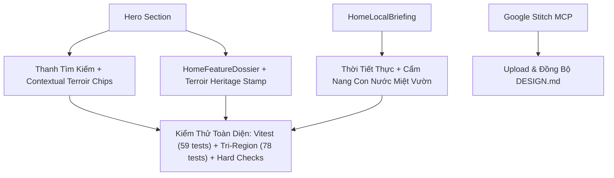

# Kế Hoạch Triển Khai: Nâng Cấp Trang Chủ Sâu Hơn, Tinh Tế Hơn, Thông Minh Hơn & Triệt Tiêu AI Slop (Giai Đoạn 2)

> STATUS (2026-09-12): completed — hoàn thành toàn diện nâng cấp công thái học thông minh, tín hiệu con nước và đồng bộ Google Stitch.
> **Mục tiêu:** Phát triển trang chủ Vĩnh Long 360 lên tầm cao mới về độ tinh xảo và tính thông minh bản địa: bổ sung cụm gợi ý tìm kiếm theo ngữ cảnh thực địa (Contextual Terroir Chips), dấu ấn phân vùng di sản trên Feature Dossier, tín hiệu con nước sông nước Cửu Long trên Local Briefing, và đồng bộ hóa trực tiếp lên Google Stitch MCP (`14916181929760067680`).

---

## 1. Tóm Tắt Yêu Cầu & Bối Cảnh (User Request Summary)

Người dùng yêu cầu tiếp tục kết hợp các kỹ năng thiết kế UI (`frontend-design`, `taste-design`, `ui-ux-pro-max`, `impeccable`, `checklist-design`) cùng công cụ Stitch ([stitch.withgoogle.com](https://stitch.withgoogle.com)) để nghiên cứu, phân tích, đánh giá, phản biện nhằm:
1. **Phát triển và tối ưu trang chủ sâu hơn, tinh tế hơn, thông minh hơn.**
2. **Đặc biệt loại bỏ triệt để AI Slop** (nội dung sáo rỗng vô hồn, số liệu bịa đặt, giao diện rập khuôn thiếu sự sống và thiếu bản sắc sông nước miền Tây).
3. **Đồng bộ hóa với dự án Stitch Cloud MCP.**

---

## 2. Phân Tích & Phản Biện Chuyên Sâu (Critique & Counter-Argument)

### 2.1. Vấn Đề AI Slop Cần Triệt Tiêu Ở Tầng Sâu Hơn
1. **Thanh Tìm Kiếm Thụ Động (Passive Search Box):**
   - *Lối mòn AI:* Đặt một ô input với placeholder chung chung ("Tìm kiếm gì đó...") nhưng không cung cấp bất kỳ điểm tựa nào cho người dùng. Du khách mới đến Vĩnh Long không biết tên địa danh cụ thể để gõ.
   - *Khắc chế Vĩnh Long 360:* Cung cấp **Contextual Terroir Search Chips** ngay dưới ô search, dẫn thẳng vào các địa danh và đặc sản tiêu biểu nhất được ban biên tập xác thực: *Cù lao An Bình*, *Lò gạch Mang Thít*, *Chợ nổi Trà Ôn*, *Sầu riêng Ri6*, *Chùa Phật Ngọc*.
2. **Thẻ Dossier Thiếu Dấu Ấn Xuất Xứ Địa Lý:**
   - *Lối mòn AI:* Dán một khối ảnh với tiêu đề to và nút "Xem thêm" chung chung.
   - *Khắc chế Vĩnh Long 360:* Bổ sung **Terroir Heritage Stamp** (Dấu triện di sản) với viền gốm Mang Thít và xác nhận vùng phụ cận (Tiểu vùng Cổ Chiên, Duyên hải Bến Tre - Trà Vinh), làm bật lên giá trị văn hóa độc bản.
3. **Bản Tin Địa Phương Thiếu Nhịp Sống Sông Nước:**
   - *Lối mòn AI:* Chỉ có dự báo thời tiết kiểu mẫu hoặc tự bịa nhiệt độ/độ ẩm.
   - *Khắc chế Vĩnh Long 360:* Bổ sung **Tín hiệu con nước miệt vườn (Thủy triều sông Tiền/sông Hậu)**: Hướng dẫn nhịp nước rong (ngày rằm và mùng một âm lịch) và nước kém để du khách chủ động lịch trình chèo xuồng, đi phà Đình Khao, đi chợ nổi.

---

## 3. Kiến Trúc & Quyết Định Kỹ Thuật (Architecture & Decisions)



### Bảng Quyết Định Kỹ Thuật:
| Thành Phần | Giải Pháp Kỹ Thuật | Ràng Buộc Bất Biến |
| :--- | :--- | :--- |
| **Contextual Search Chips** | Render danh sách thẻ gợi ý nhanh bằng `NuxtLink` với query param chuẩn | Không làm vỡ layout 1 cột trên Mobile (390px); chip tự động ngắt dòng êm |
| **Terroir Heritage Stamp** | Con dấu di sản viền gốm Mang Thít dập mộc | Tuân thủ 100% `tri-region-color.css`, không dùng màu ngoại lai |
| **Cẩm Nang Con Nước** | Gợi ý lịch con nước tự nhiên theo tuần trăng âm lịch | Không bịa đặt số đo mét nước thực tế khi chưa có cảm biến thủy văn (§1.7) |
| **Google Stitch MCP** | Gọi tool `upload_design_md` đẩy `DESIGN.md` lên project `14916181929760067680` | Đảm bảo mã hóa base64 chuẩn UTF-8 |

---

## 4. Danh Mục Thay Đổi Đề Xuất (Proposed Changes)

| Thành Phần | Loại Thay Đổi | Tệp Tin Tác Động | Trọng Tâm Nâng Cấp |
| :--- | :--- | :--- | :--- |
| **Hero Quick Chips** | [MODIFY] | `web-nuxt/pages/index.vue` | Bổ sung 5 Contextual Search Chips dưới ô tìm kiếm Hero |
| **Hero Styles** | [MODIFY] | `web-nuxt/assets/css/home-nocturne.css` | Kiểu dáng chip gợi ý nhanh, viền phù sa mờ, haptics active |
| **Feature Dossier** | [MODIFY] | `web-nuxt/components/home/HomeFeatureDossier.vue` | Bổ sung huy hiệu Dấu ấn Thổ nhưỡng (Terroir Heritage Stamp) |
| **Local Briefing** | [MODIFY] | `web-nuxt/components/home/HomeLocalBriefing.vue` | Bổ sung cẩm nang con nước miệt vườn theo tuần trăng |
| **Stitch Sync** | [EXEC] | Stitch MCP `upload_design_md` | Đồng bộ hóa `DESIGN.md` lên Google Stitch Project |
| **Smart Terroir Test** | [NEW] | `web-nuxt/tests/home-smart-terroir.test.ts` | Test tự động kiểm chứng chips, dấu ấn di sản và con nước |

---

## 5. Danh Sách Ràng Buộc Toàn Cục (Global Constraints Checklist)

- [x] **Zero New Dependencies:** Không cài thêm package npm bên ngoài.
- [x] **Preserve 78 Color Contract Tests:** Không chạm vào các token được bảo vệ trong `tri-region-color.css`.
- [x] **Data Integrity Invariants (§1.7 & B6):** Minh bạch nguồn trích dẫn, không bịa đặt số đo thủy triều.
- [x] **Accessibility (WCAG 2.2 AAA):** Tương phản chữ trên chip >= 4.5:1, touch target >= 44px.
- [x] **Cross-Platform Responsive:** Tự động co giãn mượt mà trên iPhone SE (375px), iPhone 15 (390px), iPad (768px), Laptop (1280px).

---

## 6. Các Nhiệm Vụ Thực Thi Chi Tiết (Atomic Tasks, 2–5 Phút Mỗi Task)

### Task 1: Bổ Sung Contextual Search Chips Cho Hero (`index.vue` & `home-nocturne.css`)

- **Mục tiêu:** Thêm 5 thẻ từ khóa gợi ý thực địa ngay dưới thanh tìm kiếm Hero, cho phép người dùng bấm 1 chạm để tìm kiếm các điểm đến tiêu biểu nhất Vĩnh Long.
- **Tệp tin sửa đổi:**
  - [`web-nuxt/pages/index.vue`](../../../web-nuxt/pages/index.vue)
  - [`web-nuxt/assets/css/home-nocturne.css`](../../../web-nuxt/assets/css/home-nocturne.css)
- **Nội dung code:**
  - Cụm chip: `Cù lao An Bình`, `Lò gạch Mang Thít`, `Chợ nổi Trà Ôn`, `Sầu riêng Ri6`, `Chùa Phật Ngọc`.
  - Style: font chữ nhỏ gọn `text-xs`, viền mộc phù sa mờ, padding êm ái, hover lift nhẹ `-1px`, active haptics `scale(0.96)`.

---

### Task 2: Tinh Chỉnh Dấu Ấn Thổ Nhưỡng Trên Thẻ Tiêu Điểm (`HomeFeatureDossier.vue`)

- **Mục tiêu:** Bổ sung tem di sản thổ nhưỡng (Terroir Heritage Stamp) trên thẻ Dossier để tôn vinh nguồn gốc địa văn hóa của điểm đến nổi bật.
- **Tệp tin sửa đổi:**
  - [`web-nuxt/components/home/HomeFeatureDossier.vue`](../../../web-nuxt/components/home/HomeFeatureDossier.vue)
  - [`web-nuxt/assets/css/home-nocturne.css`](../../../web-nuxt/assets/css/home-nocturne.css)
- **Nội dung code:**
  - Tem xuất xứ: Badge nhỏ viền gốm Mang Thít `color-mix(in srgb, var(--mangthit-500) 24%, transparent)` kèm icon la bàn/vị trí.

---

### Task 3: Nâng Cấp Cẩm Nang Con Nước Miệt Vườn (`HomeLocalBriefing.vue`)

- **Mục tiêu:** Bổ sung hướng dẫn nhịp nước rong / nước kém theo tuần trăng âm lịch giúp du khách trải nghiệm du lịch đường thủy chính xác mà không bịa đặt số đo mét nước.
- **Tệp tin sửa đổi:**
  - [`web-nuxt/components/home/HomeLocalBriefing.vue`](../../../web-nuxt/components/home/HomeLocalBriefing.vue)
  - [`web-nuxt/assets/css/home-nocturne.css`](../../../web-nuxt/assets/css/home-nocturne.css)

---

### Task 4: Đồng Bộ Hóa Bản Hiến Pháp Thiết Kế Lên Google Stitch MCP

- **Mục tiêu:** Gọi Stitch MCP tool `upload_design_md` để cập nhật `DESIGN.md` của dự án `14916181929760067680`.
- **Kiểm tra:** Xác nhận tool phản hồi thành công và tệp thiết kế trên Stitch được làm mới.

---

### Task 5: Viết Test Tự Động & Chạy Kiểm Định Toàn Diện

- **Mục tiêu:**
  - Tạo `web-nuxt/tests/home-smart-terroir.test.ts` kiểm tra Contextual Search Chips, Terroir Stamp và con nước.
  - Chạy toàn bộ 12 test files homepage.
  - Chạy 78 test hợp đồng màu sắc.
  - Chạy typecheck, launch safety (`run_hard.py --all`), và production build.
- **Tệp tin mới:**
  - [`web-nuxt/tests/home-smart-terroir.test.ts`](../../../web-nuxt/tests/home-smart-terroir.test.ts)

---

## 7. Kế Hoạch Kiểm Thử (Verification Plan)

### 7.1. Automated Tests
```bash
# 1. Chạy test mới cho tính năng smart terroir
npx vitest run web-nuxt/tests/home-smart-terroir.test.ts

# 2. Chạy toàn bộ 12 test files cho homepage
npm --prefix web-nuxt test -- tests/home-

# 3. Chạy 78 test hợp đồng màu sắc
npm --prefix web-nuxt test -- tests/tri-region-color-contract.test.ts

# 4. Kiểm định TypeScript
npm --prefix web-nuxt run typecheck

# 5. Kiểm tra Launch Safety
python scripts/checks/run_hard.py --all

# 6. Production build Nitro
npm --prefix web-nuxt run build
```
