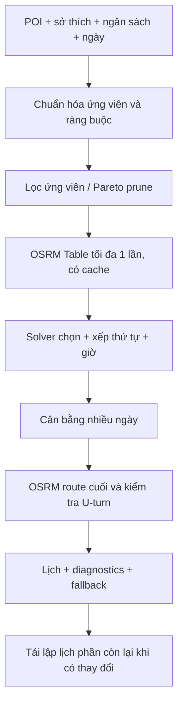

# Lộ trình tối ưu lịch trình đa mục tiêu, không phát sinh chi phí

> STATUS: active
> Ngày: 2026-07-29
> Phạm vi: thiết kế các giai đoạn kế tiếp sau bộ tối ưu tuyến có hướng đợt 1

## 1. Quyết định kiến trúc

Chọn kiến trúc **hybrid phân cấp với solver portfolio thích ứng**:

1. Chuẩn hóa dữ liệu POI và ràng buộc lịch.
2. Lọc ứng viên theo giá trị, khu vực, mùa và dữ liệu chất lượng.
3. Lấy chi phí đường thực bằng tối đa một request OSRM Table có cache trong mỗi lần người dùng chủ động tối ưu.
4. Tối ưu đồng thời việc chọn điểm, thứ tự và thời gian trong từng ngày.
5. Cân bằng điểm giữa các ngày và thực hiện cải thiện chéo ngày.
6. Khi lịch thay đổi trong lúc chuyến đi diễn ra, đóng băng phần đã hoàn thành và tối ưu lại phần còn lại.

Phương án này giữ được chất lượng gần solver thống nhất nhưng cho phép phát hành từng giai đoạn, có fallback cục bộ và không buộc hệ thống phải giải bài toán lớn trong một lần.



## 2. Bất biến về chi phí và tương thích

- Không thêm API trả phí, API key, máy chủ, container, Python/NPM dependency hoặc LLM runtime.
- OSRM Table chỉ được gọi khi người dùng bấm tối ưu và tối đa một lần cho một fingerprint gồm tọa độ, phương tiện và phiên bản dữ liệu.
- OSRM route cuối dùng luồng hiện tại: một lần cho thứ tự đầu tiên và tối đa một lần retry khi phát hiện U-turn.
- Không gọi OSRM nền khi người dùng chỉ sửa ghi chú, thời lượng thủ công hoặc kéo thả ngoài nút tối ưu.
- Cache ma trận chỉ ở bộ nhớ tiến trình hoặc phiên trình duyệt, có TTL ngắn; không thêm bảng DB và không ghi tọa độ mới vào DB.
- Nếu Table lỗi, timeout, thiếu cặp hoặc bị giới hạn truy cập, solver chuyển sang ma trận Haversine đối xứng kèm penalty hướng/lateral và ghi cảnh báo rõ ràng.
- Không đổi response `generate_itinerary` hiện tại trong các giai đoạn đầu; trường mới chỉ được thêm theo hướng tương thích ngược.
- Giữ giới hạn tối đa 20 điểm được gửi vào bộ solver tuyến hiện tại; danh sách ứng viên trước khi chọn có thể lớn hơn nhưng phải được prune có giới hạn.

## 3. Khoảng trống hiện tại cần giải quyết

- `agent/itinerary_gen.py` hiện chấm điểm POI theo confidence, mùa, khu vực và loại entity, sau đó chọn đa dạng theo vòng khu vực.
- Thời gian tham quan đang lấy từ `VISIT_DURATION` theo loại; thời gian di chuyển đang cộng cố định 30 phút cho mỗi điểm.
- Giờ mở cửa mới được đưa vào ghi chú, chưa phải ràng buộc cứng hay mềm khi xếp giờ.
- `agent/itinerary_optimizer.py` tối ưu thứ tự bằng chiếu lên hành lang thẳng, Haversine, exact DP/beam search và local search; chưa dùng ma trận thời gian đường thực.
- Planner thủ công đã có retry U-turn giới hạn; generator nhiều ngày chưa dùng chung solver chọn/xếp lịch.

## 4. Hợp đồng dữ liệu nội bộ

Các hợp đồng này là dataclass/TypedDict nội bộ, chưa buộc thay đổi schema lưu lịch trình.

### 4.1. `PoiCandidate`

```text
id: str
coordinates: (lat, lng) | None
area: str | None
type: str
reward: float
interest_tags: frozenset[str]
visit_minutes: int
opening_windows: tuple[(start_minute, end_minute), ...] | None
fee_value: float | None
required: bool
confidence: float
```

Quy tắc chuẩn hóa:

- Tọa độ không hợp lệ hoặc đánh dấu gần đúng không được dùng làm cạnh đường thực; POI vẫn có thể được giữ như điểm không định tuyến.
- `visit_minutes` lấy từ dữ liệu cụ thể nếu có, sau đó rơi về `VISIT_DURATION` theo loại.
- `opening_windows = None` nghĩa là chưa biết giờ mở cửa, không tự động coi là mở cả ngày nếu POI có nguy cơ đóng cửa; solver chỉ áp dụng penalty cảnh báo cho dữ liệu thiếu.
- Cửa sổ qua nửa đêm được tách thành hai đoạn trong ngày kế tiếp, không dùng số âm.

### 4.2. `RouteCostMatrix`

```text
keys: tuple[str, ...]
distance_km: matrix[float | None]
duration_minutes: matrix[float | None]
source: "osrm-table" | "haversine-fallback"
mode: "driving" | "walking" | ...
cache_key: str
complete: bool
warnings: tuple[str, ...]
```

Ma trận được coi là bất đối xứng. Cặp thiếu hoặc không đi được có giá trị `None` và bị loại khỏi cạnh cứng.

### 4.3. `ScheduleResult`

```text
days: tuple[DaySchedule, ...]
objective: ObjectiveBreakdown
solver: str
warnings: tuple[str, ...]
fallback_level: "none" | "matrix" | "schedule" | "original"
```

`DaySchedule` phải ghi `arrival`, `start_visit`, `end_visit`, `departure`, `slack_minutes`, `late_minutes` và lý do bỏ điểm nếu có.

## 5. Hàm mục tiêu và thứ tự ưu tiên

Không dùng một tổng trọng số duy nhất để che giấu vi phạm. Solver so sánh nghiệm theo thứ tự từ cứng đến mềm:

1. Không bỏ điểm `required`.
2. Không vi phạm cửa sổ giờ cứng và giờ kết thúc ngày.
3. Không dùng cạnh bị cấm hoặc cạnh không có chi phí.
4. Giảm tổng thời gian đường thực, số lần quay đầu và tỷ lệ backtrack.
5. Giảm overtime và tăng tổng slack tối thiểu.
6. Tăng reward sở thích, chất lượng và độ đa dạng.
7. Giảm phí ước tính, số lần đổi khu vực và chênh lệch tải giữa các ngày.

Trong cùng một tầng, dùng Pareto dominance; chỉ dùng trọng số chuẩn hóa để phân xử các nghiệm không bị trội nhau. Mỗi response phải trả breakdown để UI giải thích vì sao một điểm bị bỏ hoặc bị dời.

## 6. Lộ trình theo giai đoạn

### Giai đoạn 2 — Lịch khả thi theo thời gian

**Trạng thái (2026-07-30):**

- **Phase 2A — hoàn tất:** planner thủ công đã có hợp đồng thời lượng/cửa sổ giờ, scheduler khả thi, repair/drop có lý do, ma trận OSRM Table được cache, fallback Haversine cục bộ, diagnostics, feature flag mặc định tắt và regression tập trung.
- **Phase 2B — chờ plan riêng:** generator vẫn chưa thay giả định di chuyển cố định 30 phút; meal/rest anchors dành riêng cho generator chưa được triển khai.

**Mục tiêu:** loại bỏ giả định “mỗi chặng cộng 30 phút” và không tạo lịch đến lúc POI đã đóng.

**Thuật toán:**

- Forward scheduling trên thứ tự điểm hiện có, dùng `duration_minutes` và `duration_minutes[i][j]` nếu có.
- Label-setting cho các trạng thái `(last_stop, time, reward, slack)`; loại trạng thái bị dominance.
- **Phase 2B (pending):** chèn meal/rest anchor ở các cửa sổ cấu hình được, không tự chèn món nếu không có candidate phù hợp.
- Repair theo thứ tự: dời điểm optional, đổi hai điểm kề nhau, relocate một điểm, rồi mới đánh dấu không khả thi.
- Điểm required không thể xếp được trả lỗi có nguyên nhân; không âm thầm phá giờ đóng cửa.

**Fallback:** nếu thiếu giờ mở cửa, lập lịch theo khoảng mặc định và gắn cảnh báo `opening-hours-unknown`; nếu thiếu ma trận, dùng tốc độ mặc định theo phương tiện và ghi `matrix-fallback`.

**Tiêu chí nghiệm thu:** zero hard violation trong fixture có dữ liệu đầy đủ; mọi điểm bị bỏ có `reason`; thời gian kết thúc không vượt giới hạn nếu còn nghiệm khả thi.

### Giai đoạn 3 — Chọn POI và xếp tuyến đồng thời

**Trạng thái:** pending; chưa có plan triển khai được duyệt.

**Mục tiêu:** không chọn nhiều POI điểm cao nhưng khiến tổng lịch quá dài hoặc kém liên quan.

**Thuật toán:**

- Prize-Collecting Orienteering with Time Windows cho mỗi ngày.
- Pre-prune theo dominance: cùng khu vực/loại, reward thấp hơn, thời lượng dài hơn và phí không thấp hơn thì loại.
- Giữ các điểm required; điểm optional có reward gồm sở thích, mùa, confidence, diversity bonus và penalty theo độ vòng.
- Exact DP/branch-and-bound cho tập nhỏ; deterministic beam search cho tập lớn; sau đó ALNS với destroy/repair có seed cố định.
- Giữ giới hạn 20 điểm sau bước chọn; trả thêm `candidate_count`, `selected_count`, `dropped_reasons`.

**Tiêu chí nghiệm thu:** tổng reward không giảm khi thêm candidate bị trội; solver không chọn trùng entity; thứ tự đầu/cuối và ràng buộc thời gian vẫn được giữ.

### Giai đoạn 4 — Tối ưu nhiều ngày

**Trạng thái:** pending; chưa triển khai.

**Mục tiêu:** tránh ngày đầu quá nặng và ngày cuối phải chạy vòng xa.

**Thuật toán:**

- Tạo anchor cho điểm xuất phát, điểm kết thúc, nơi lưu trú và sự kiện cố định.
- Cluster ban đầu theo khu vực và hành lang, nhưng cho phép điểm ở ranh giới được chuyển ngày.
- Phân bổ ngày bằng DP trên tổng thời gian khả dụng và reward; sau đó cross-day swap, relocate và 2-opt*.
- Tối ưu lexicographic: không vi phạm anchor/giờ trước, cân bằng thời lượng, rồi mới giảm tổng quãng đường.
- Nếu thiếu anchor lưu trú, dùng điểm cuối ngày của ngày trước làm start xấp xỉ và ghi cảnh báo, không tự bịa địa chỉ.

**Tiêu chí nghiệm thu:** mỗi ngày có diagnostics riêng; tổng thời gian và số điểm khớp input; không làm mất metadata hoặc thay đổi thứ tự tương đối của điểm bị khóa.

### Giai đoạn 5 — Tái lập lịch động

**Trạng thái:** pending; chưa triển khai.

**Mục tiêu:** xử lý đi trễ, bỏ điểm, POI đóng cửa hoặc thay đổi phương tiện.

**Thuật toán:**

- Trạng thái điểm: `planned`, `arrived`, `completed`, `skipped`, `locked`.
- Đóng băng các điểm đã hoàn thành và điểm đang tham quan; chỉ giải lại suffix còn lại.
- Propagate thời gian trễ vào arrival/slack của suffix.
- Nếu không còn nghiệm, fallback theo thứ tự: bỏ optional có penalty thấp nhất, rút ngắn nghỉ, giữ required, rồi giữ nguyên thứ tự còn lại.
- Không gọi lại OSRM nếu thay đổi chỉ làm giảm thời gian và ma trận cache vẫn hợp lệ.

**Tiêu chí nghiệm thu:** không di chuyển điểm đã hoàn thành; tối đa một lần replan cho một sự kiện UI; log rõ nguyên nhân thay đổi.

### Giai đoạn 6 — Tự hiệu chỉnh cục bộ

**Trạng thái:** pending; chưa triển khai.

**Mục tiêu:** cải thiện ước lượng mà không thêm mô hình trả phí hoặc pipeline học mới.

**Thuật toán:**

- Từ leg OSRM đã gọi, cập nhật median/EWMA theo phương tiện, khoảng cách và nhóm khu vực.
- Chỉ dùng dữ liệu đã được route thành công; không ghi đè dữ liệu gốc POI.
- Cache trong bộ nhớ hoặc artifact cục bộ có TTL; reset được khi phiên bản thuật toán đổi.
- Không tự gọi web để “học thêm”; không đưa dữ liệu chưa xác thực vào giờ mở cửa.

**Tiêu chí nghiệm thu:** điều chỉnh không làm giảm an toàn của hard constraints; có thể tắt hoàn toàn bằng flag; fallback về default khi mẫu quan sát quá ít.

## 7. Ngân sách request và thời gian

Cho một lần tối ưu do người dùng kích hoạt:

| Tác vụ | Giới hạn |
| --- | ---: |
| OSRM Table | Tối đa 1 request |
| OSRM route ban đầu | Tối đa 1 request |
| OSRM retry chặn U-turn | Tối đa 1 request |
| OSRM request nền | 0 |
| LLM request trong solver | 0 |
| Solver CPU local | deadline cấu hình, mặc định 2 giây cho 20 điểm |

Nếu vượt deadline, trả nghiệm tốt nhất hợp lệ đã có; nếu chưa có nghiệm, trả thứ tự đầu vào kèm cảnh báo thay vì treo hoặc trả JSON thiếu.

## 8. API và tương thích

- Giữ nguyên `POST /api/itineraries/optimize-order` cho thao tác sắp thứ tự điểm đã có.
- Thêm adapter nội bộ `optimize_itinerary_plan(...)` trước; chỉ mở endpoint mới sau khi hợp đồng ổn định.
- Không thay đổi schema lịch trình đã lưu.
- Các field mới đều optional và có default an toàn: `start_time`, `end_time`, `visit_minutes`, `opening_windows`, `required`, `meal_anchors`, `budget_cap`.
- Generator cũ tiếp tục trả `day_plans`; adapter có thể bổ sung diagnostics ở field mới mà consumer cũ bỏ qua.

## 9. Kiểm thử và quan sát

### Unit/property tests

- Ma trận bất đối xứng, cặp không đi được, cache hit/miss và fallback.
- Cửa sổ giờ qua nửa đêm, giờ mở cửa thiếu, thời lượng bằng 0 và điểm required.
- Dominance không loại nhầm nghiệm tốt hơn.
- Exact solver đối chiếu brute force với tập nhỏ.
- Beam/ALNS deterministic với seed cố định và deadline.
- Cross-day move giữ anchor và metadata.
- Replan không thay đổi điểm đã khóa.

### Golden fixtures

- Tuyến thẳng, tuyến cong, cầu/phà, điểm hai bên đường, POI trùng tọa độ.
- Một ngày quá tải, nhiều ngày lệch tải, giờ ăn xung đột, POI đóng cửa.
- OSRM lỗi, timeout, ma trận thiếu một phần và U-turn còn tồn tại sau retry.

### Metrics không chứa dữ liệu nhạy cảm

`route_call_count`, `matrix_source`, `fallback_level`, `solver`, `hard_violation_count`, `overtime_minutes`, `backtrack_ratio`, `distance_saved_km`, `selected_count`, `dropped_count`, `replan_count`, `elapsed_ms`.

## 10. Rollout và an toàn

1. Phát hành Giai đoạn 2 sau feature flag, chỉ bật cho planner thủ công.
2. So sánh diagnostics với baseline nhưng không tự đổi lịch đã lưu.
3. Bật Giai đoạn 3 cho lịch mới sau khi fixture giờ mở cửa ổn định.
4. Mở Giai đoạn 4-6 từng bước; mỗi bước có kill switch và giữ fallback cũ.
5. Không deploy production hoặc chạy migration trong phạm vi đặc tả này.

## 11. Rủi ro và giới hạn

- OSRM công cộng là dịch vụ dùng chung; cache và giới hạn request là bắt buộc dù không có chi phí tiền.
- Tọa độ POI gần đúng không bảo đảm lối vào thực tế không phải quay đầu.
- Giờ mở cửa thiếu hoặc không chuẩn hóa có thể tạo cảnh báo thay vì nghiệm chắc chắn.
- ALNS/beam trên tập lớn là heuristic; chỉ exact DP/branch-and-bound mới có bảo đảm tối ưu trong giới hạn nhỏ.
- Không được gọi “tối ưu tuyệt đối” nếu ma trận là fallback hoặc còn hard warning.

## 12. Phạm vi triển khai tiếp theo

**Phase 2A đã hoàn tất** cho planner thủ công. Đợt kế tiếp của Giai đoạn 2 là **Phase 2B** với generator adoption: thay giả định di chuyển cố định 30 phút và bổ sung meal/rest anchors dành riêng cho generator. Phase 2B và Giai đoạn 3-6 đều cần plan riêng; không mục nào được coi là hoàn tất bởi đợt Phase 2A này.
